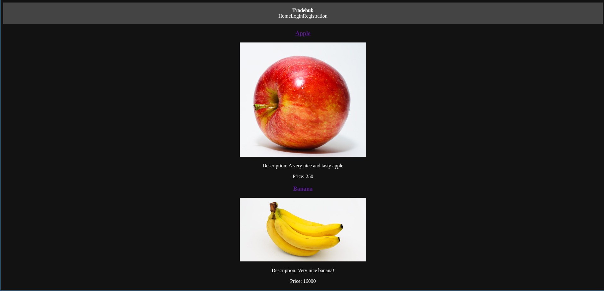

# Tradehub

- [About](#About)
  - [Features](#Features)
  - [Tech Stack](#Tech-Stack)
- [Running the application](#Running-the-application)
  - [Install dependencies](#Install-dependencies)
  - [Run backend](#Run-backend)
  - [Run frontend](#Run-frontend)
- [Documentation](#Documentation)
  - [ENV variables](#ENV-variables)
  - [Endpoints](#Endpoints)
  - [Directory structure](#Directory-structure)

# About

A full-stack marketplace application inspired by eBay, built to explore backend development in C#, MongoDB integration, and modern React frontend architecture.

## Features

- User authentication with JWT
- Create and manage listings
- Shopping cart system
- Virtual currency system
- User profile management

## Tech Stack

- Backend: C# (.NET)
- Frontend: React (Vite)
- Database: MongoDB
- Authentication: JWT



See more images here: [Screenshots](./docs/images.md)

# Running the application

## Clone the repository

``` bash
git clone https://github.com/Helland369/Tradehub.git
```

## Install dependencies

Install the dependencies for node (frontend):

``` bash
cd Tradehub/frontend
npm install
```

Install the dependencies for the backend:

``` bash
cd Tradehub/backend
dotnet restore
```

## Run backend

``` bash
cd Tradehub/backend
dotnet run
```

## Run frontend

``` bash
cd Tradehub/frontend
npm run dev
```

# Documentation

## ENV variables

Place the .env file in "Tradehub/backend".

The required ENV variables:

```
MONGODB="mongodb://127.0.0.1:27017/tradehub"
JWT_ISSUER="tradehub"
JWT_AUDIENCE="tradehub"
JWT_KEY=run: openssl rand -base64 64
```


## Endpoints

| Endpoint                  | Type   | Authorization | Usage                                |
|:--------------------------|:-------|:--------------|:-------------------------------------|
| api/users                 | POST   | No            | Create a new user account.           |
| api/users/{userId}        | GET    | No            | Get existing user by ID              |
| api/auth                  | POST   | No            | Authorize login and create JWT token |
| api/edituser              | PATCH  | Yes           | Edit user data                       |
| api/listings              | GET    | No            | Get all listings                     |
| api/listings/{itemId}     | GET    | No            | Get listings by id                   |
| api/create_listing        | POST   | Yes           | Create a listing                     |
| api/add_to_cart           | POST   | Yes           | Add item to cart                     |
| api/buy_shopping_cart     | POST   | Yes           | Buy items in cart                    |
| api/remove_from_cart      | DELETE | Yes           | Remove item from cart                |
| api/get_all_shopping_cart | GET    | Yes           | Get all items in shopping cart       |
| api/addcurrency           | POST   | Yes           | Add fake currency to user account    |


## Directory structure

``` bash
|- Tradehub
|  |- backend
|  |  |- Backend root
|  |  |- Controller
|  |  |  |- Api controllers
|  |  |- Dtos
|  |  |  |- Dtos
|  |  |- Models
|  |  |  |- Data models
|  |  |- Services
|  |  |  |- Services
|  |  |- wwwroot
|  |  |  |- Images from user upload
|  |- frontend
|  |  |- frontend root
|  |  |- src
|  |  |  |- components
|  |  |  |  |- Reusable components for frontend
|  |  |  |- pages
|  |  |  |  |- The web pages
|  |  |  |- styles
|  |  |  |  |- Contains css
```
